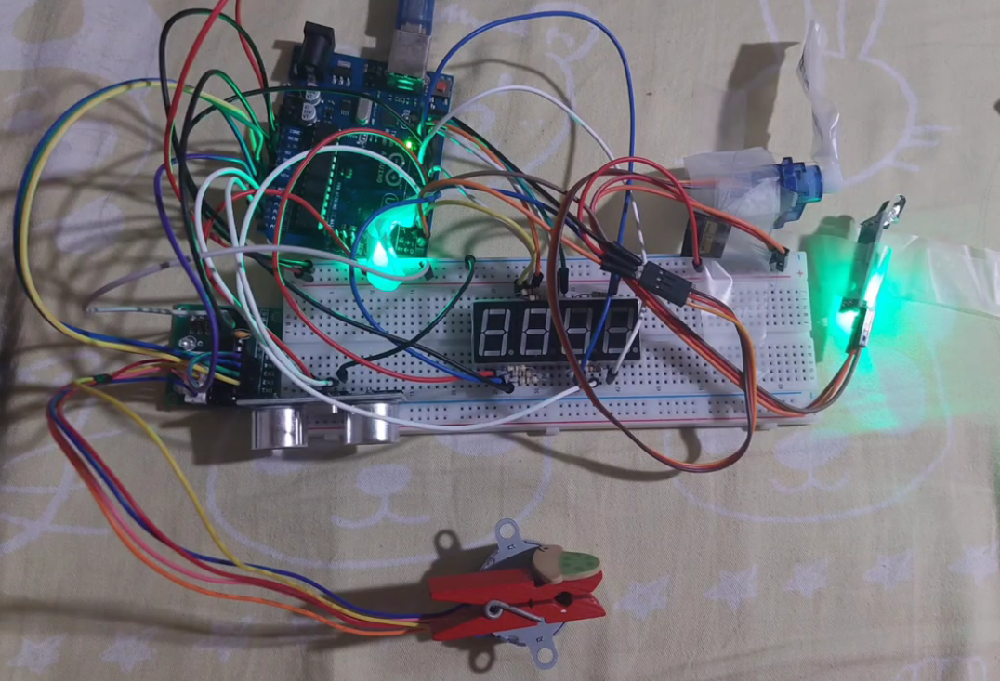

# Parking Lot Counter

An Arduino-based automated parking lot counter that detects incoming and outgoing vehicles, tracks the number of occupied and available parking spaces, and controls the parking gate using sensors, motors, and a 4-digit 7-segment display.

# About the Project

This is an embedded systems project that demonstrates how an Arduino can be used to automate a parking lot management system. The system uses an IR sensor to detect vehicles entering the parking lot and an ultrasonic sensor to detect vehicles at the exit. The Arduino keeps track of the number of occupied and available parking spaces and displays these values using a 4-digit 7-segment display.

The system also uses a servo motor to control the entrance gate and a stepper motor to operate the exit mechanism. The parking lot has a maximum capacity of 10 cars.

## Prototype

# Key Features

- Automated vehicle entry detection using an IR sensor
- Vehicle exit detection using an ultrasonic sensor
- Automatic entrance gate control using a servo motor
- Stepper motor control for the exit gate
- Parking capacity limit of 10 cars
- Tracks the number of occupied and available parking spaces
- 4-digit 7-segment display for parking information
- Ultrasonic distance detection for vehicles at the exit
- Automatic gate movement based on vehicle detection
- Real-time updating of parking space information

# Hardware Used

- Arduino microcontroller board
- IR sensor
- Ultrasonic sensor
- Servo motor
- Stepper motor
- 4-digit 7-segment display
- Breadboard
- Jumper wires
- Resistors
- Motor driver/control circuitry

# Pin Connections

| **Function** | **Arduino Pins** |
| --- | --- |
| Ultrasonic Trigger | A4 |
| Ultrasonic Echo | A5 |
| Servo Motor | Pin 0 |
| IR Sensor | Pin 1 |
| Stepper Motor Coil 1 | A0 |
| Stepper Motor Coil 2 | A1 |
| Stepper Motor Coil 3 | A2 |
| Stepper Motor Coil 4 | A3 |
| 7-Segment Segment A | Pin 7 |
| 7-Segment Segment B | Pin 3 |
| 7-Segment Segment C | Pin 4 |
| 7-Segment Segment D | Pin 5 |
| 7-Segment Segment E | Pin 6 |
| 7-Segment Segment F | Pin 2 |
| 7-Segment Segment G | Pin 8 |
| 7-Segment Decimal Point | Pin 9 |
| Display Digit 1 | Pin 10 |
| Display Digit 2 | Pin 11 |
| Display Digit 3 | Pin 12 |
| Display Digit 4 | Pin 13 |

# System Operation

### Vehicle Entry

When the IR sensor detects a vehicle and the parking lot has not reached its maximum capacity:

1. The car count is increased by one.
2. The number of available slots is decreased by one.
3. The servo motor opens the entrance gate.
4. The parking information is updated on the 7-segment display.
5. After the vehicle passes the sensor, the servo returns the gate to its closed position.

The parking lot can accommodate a maximum of **10 cars**.

### Parking Capacity

When the parking lot reaches its maximum capacity, the system displays the full-state indication on the 7-segment display.

No additional vehicle can be counted as entering while the car count is already at the maximum capacity.

### Vehicle Exit

The ultrasonic sensor monitors the exit area. When a vehicle is detected within approximately 10 cm, the system activates the exit sequence.

The stepper motor rotates using an 8-step sequence to control the exit mechanism. The display is also updated during the exit process.

Once the vehicle is no longer detected by the ultrasonic sensor, the system returns to its normal parking count display.

# Display Information

The 4-digit 7-segment display shows the current parking information.

The system calculates:

- **Available slots** — Number of remaining spaces in the parking lot
- **Car count** — Number of cars currently inside the parking lot

The display is continuously refreshed while the system is operating.

# Motor Control

The entrance gate uses a servo motor that moves between its closed and open positions when a vehicle is detected.

The exit mechanism uses a stepper motor controlled through an 8-step sequence. The program uses 300 cycles of the sequence to produce the programmed gate movement.

# Video Documentation

- [Project Demonstration and Testing Videos](https://drive.google.com/drive/folders/1hjs9SySacAAUoF00kYV-Y0AT4d_VAFSj?usp=sharing)
